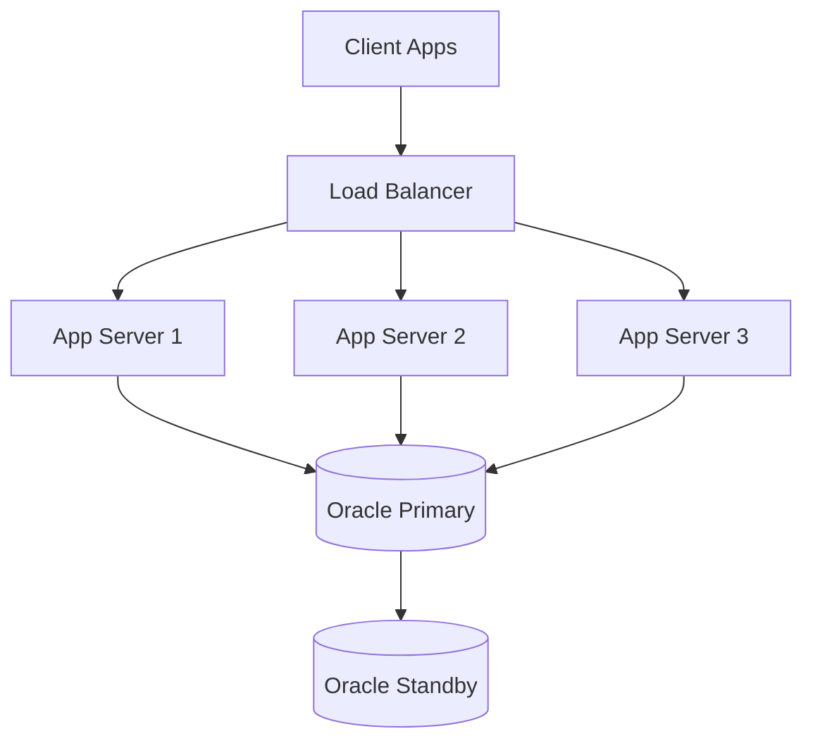

# 🛍️ Online Shopping System - Java & Oracle


## 📌 Overview
A comprehensive object-oriented, multithreaded client-server system for an online shopping platform using Java and Oracle Database.

## 🌟 Key Features
- **Multi-threaded Architecture**: Efficient handling of concurrent operations  
- **Role-based Authentication**: JWT-based security for Customers, Sellers, Admins  
- **Inventory Management**: Real-time stock tracking with notifications  
- **Order Processing**: Transactional workflow with ACID compliance  
- **Payment Integration**: Multiple gateway support via Adapter pattern  

## 🏗️ System Architecture


## 🛠️ Technology Stack

| Component      | Technology                  |
|---------------|-----------------------------|
| Backend        | Java 17+, Hibernate/JPA     |
| Database       | Oracle 19c/21c              |
| Concurrency    | ExecutorService, CompletableFuture |
| Build Tool     | Maven/Gradle                |
| Client Options | JavaFX, Swing, REST API     |

## 💻 Core Implementation

```java
// Multithreaded Order Processing Example
public class OrderProcessor {
    private final ExecutorService executor = Executors.newFixedThreadPool(10);
    
    public CompletableFuture<Order> processOrderAsync(Order order) {
        return CompletableFuture.supplyAsync(() -> {
            processPayment(order);
            updateInventory(order);
            notifyParties(order);
            return order;
        }, executor);
    }
}
```

## 🗃️ Database Schema Highlights

```sql
CREATE TABLE users (
    user_id NUMBER PRIMARY KEY,
    username VARCHAR2(50) UNIQUE NOT NULL,
    password_hash VARCHAR2(255) NOT NULL,
    user_type VARCHAR2(20) CHECK (user_type IN ('CUSTOMER', 'SELLER', 'ADMIN'))
);

CREATE TABLE products (
    product_id NUMBER PRIMARY KEY,
    seller_id NUMBER REFERENCES sellers(seller_id),
    name VARCHAR2(100) NOT NULL,
    price NUMBER(10,2) NOT NULL,
    stock_quantity NUMBER NOT NULL
);

CREATE TABLE orders (
    order_id NUMBER PRIMARY KEY,
    customer_id NUMBER REFERENCES customers(customer_id),
    status VARCHAR2(20) CHECK (status IN ('PENDING', 'PAID', 'SHIPPED')),
    total_amount NUMBER(10,2) NOT NULL
);
```

## 🎨 Design Patterns

**Factory Method**: Product category creation  
```java
public interface ProductFactory {
    Product createProduct();
}
```

**Observer**: Stock notifications  
```java
public interface StockObserver {
    void onStockChanged(Long productId, int newQuantity);
}
```

**Adapter**: Payment gateways  
```java
public class PayPalAdapter implements PaymentProcessor {
    private PayPalSDK paypal;
    // Adapts PayPal interface to our system
}
```

## 🚀 Getting Started

### Prerequisites
- JDK 17+  
- Oracle Database 19c/21c  
- Maven 3.6+  

### Installation
```bash
git clone https://github.com/Omimas/Software-engineering-2.git
cd Software-engineering-2
mvn clean install
```

### Configuration
```properties
# application.properties
db.url=jdbc:oracle:thin:@//localhost:1521/ORCLCDB
db.username=system
db.password=your_secure_password
server.port=8080
jwt.secret=your_jwt_secret_key
```

## 🤝 Contribution Workflow

1. Fork the repository  
2. Create your feature branch (`git checkout -b feature/AmazingFeature`)  
3. Commit your changes (`git commit -m 'Add some AmazingFeature'`)  
4. Push to the branch (`git push origin feature/AmazingFeature`)  
5. Open a Pull Request  

## 📜 License
Distributed under the MIT License. See LICENSE for more information.

## 📧 Contact
**Project Maintainer** – Eren D. Budak  
**Project Link** – [https://github.com/Omimas/Software-engineering-2](https://github.com/Omimas/Software-engineering-2)
